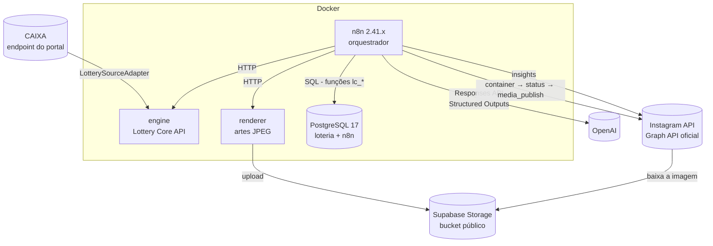
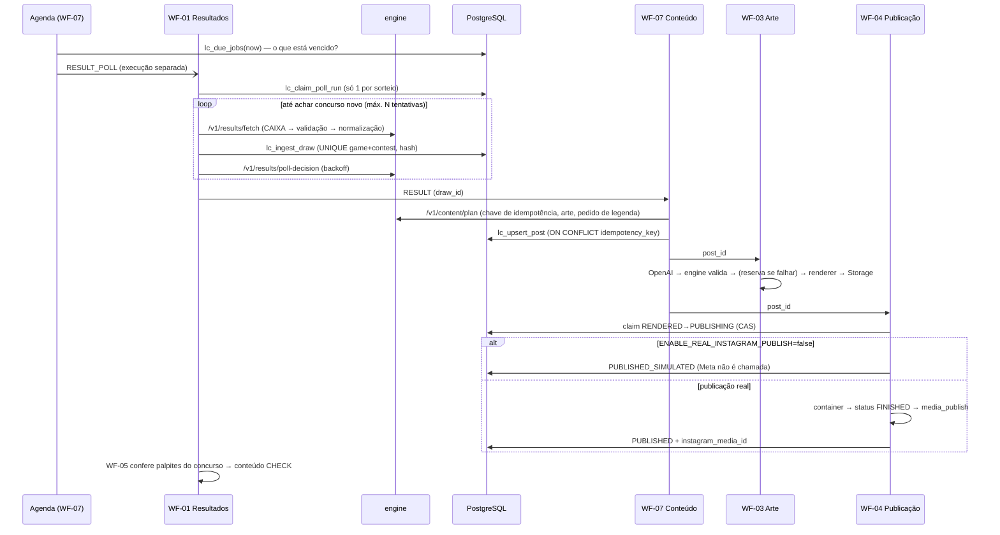
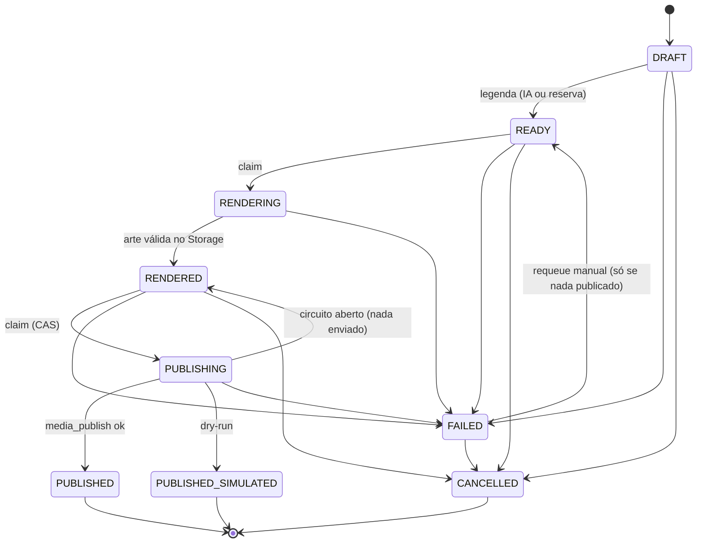

# Arquitetura — Loteria Cursos Social Media Automation

## Visão geral

| Peça                          | Papel                                                                                                                                                                           | Onde                                                |
| ----------------------------- | ------------------------------------------------------------------------------------------------------------------------------------------------------------------------------- | --------------------------------------------------- |
| **n8n**                       | Orquestra: agenda, laços de espera, decisões, chamadas externas com credenciais                                                                                                 | `n8n/workflows/*.json` (gerados por `n8n/builder/`) |
| **engine** (Lottery Core API) | Lógica determinística testada: fonte de resultados, validação, normalização, palpites, conferência, plano de conteúdo, validação da legenda, classificação de respostas da Meta | `apps/engine` + `packages/lottery-core`             |
| **renderer**                  | Templates fixos → JPEG 1080×1350 (feed) / 1080×1920 (story) → Storage                                                                                                           | `apps/renderer`                                     |
| **PostgreSQL**                | Fonte da verdade + travas finais (UNIQUE, triggers, máquina de estados, CAS)                                                                                                    | `database/migrations`                               |
| **mock-server**               | Simula CAIXA/OpenAI/Meta/Storage para testes (nunca em produção)                                                                                                                | `apps/mock-server`                                  |

Princípio: **o n8n decide "quando" e "o quê"; o código testado decide "como"; o banco garante que nada duplique ou corrompa.**

## Workflows

| Workflow                       | Disparo                                   | Faz                                                                                                      |
| ------------------------------ | ----------------------------------------- | -------------------------------------------------------------------------------------------------------- |
| WF-00-System-Health            | a cada 6h, webhook GET, sub-workflow      | testa n8n, banco, engine, fonte, OpenAI (`GET /models`), renderer, storage, Meta (`GET /me`) — sem custo |
| WF-01-Sync-Lottery-Results     | sub-workflow (agenda/manual)              | busca → valida → grava → conteúdo RESULT → conferência; polling com backoff; backfill                    |
| WF-02-Generate-Predictions     | sub-workflow                              | histórico → gerador determinístico → banco → conteúdo PREDICTION                                         |
| WF-03-Render-Social-Post       | sub-workflow                              | legenda (OpenAI + reserva) e arte (renderer + Storage)                                                   |
| WF-04-Publish-Instagram        | sub-workflow                              | publicação idempotente (dry-run, circuit breaker, retries)                                               |
| WF-05-Check-Prediction-Results | sub-workflow                              | conferência determinística → conteúdo CHECK                                                              |
| WF-06-Instagram-Analytics      | diário 09:12, manual                      | métricas oficiais → `instagram_insights`                                                                 |
| WF-07-Content-Orchestrator     | a cada 10 min, webhook POST, sub-workflow | agenda (`lc_due_jobs`), teste manual, **trabalho de conteúdo** (plano → post → WF-03 → WF-04)            |
| WF-99-Global-Error-Handler     | Error Trigger + sub-workflow              | grava `workflow_errors` sem segredos; alerta opcional                                                    |

## Fluxo de dados e regra de ouro dos resultados

`Fonte → validação estrutural → validação das dezenas → validação do concurso → persistência → renderização → publicação`

- A IA **nunca** recebe a tarefa de escrever, interpretar ou contar números oficiais. O pedido à OpenAI contém só tipo de conteúdo, modalidade, se acumulou e o número de coincidências (já calculado), com a instrução de **não** citar dados.
- A resposta da IA é validada (schema JSON estrito, regras editoriais, integridade: não pode listar dezenas, citar valores em R$ ou outro concurso). O bloco com os dados oficiais é **montado por código** e inserido na legenda.
- A arte usa só dados oficiais e textos fixos/configurados.

## Idempotência e concorrência

| Risco                                  | Barreira                                                                                                                                       |
| -------------------------------------- | ---------------------------------------------------------------------------------------------------------------------------------------------- |
| Mesmo concurso gravado 2×              | `UNIQUE(game_id, contest)` + `INSERT … ON CONFLICT DO NOTHING` (`lc_ingest_draw`)                                                              |
| Mesmo concurso com conteúdo diferente  | `source_hash` (SHA-256 do resultado normalizado imutável) → `DATA_CONFLICT`, sem sobrescrever, publicação bloqueada                            |
| Mesmo post criado 2×                   | `UNIQUE(idempotency_key)` (`result:megasena:3065:feed`) + `ON CONFLICT` (`lc_upsert_post`)                                                     |
| Duas execuções publicando o mesmo post | claim atômico `UPDATE … WHERE status='RENDERED'` (compare-and-swap) — só uma vence                                                             |
| Publicação real duplicada              | índice único parcial `(type, game, contest, format) WHERE status='PUBLISHED'` + ID de mídia imutável + um container da Meta só publica uma vez |
| Dois pollings do mesmo sorteio         | `UNIQUE(game_id, scheduled_draw_at)` em `result_poll_runs`                                                                                     |
| Palpite gerado 2×                      | `UNIQUE(game, contest, method, algorithm_version, variant)`                                                                                    |

Dry-run usa chave com sufixo `:dryrun`, então uma simulação nunca bloqueia a publicação real do mesmo concurso.

O efeito de negócio é _exactly-once_ mesmo com APIs externas _at-least-once_: o banco é a barreira final.

## Máquina de estados dos posts

Implementada em dois lugares que um teste garante serem idênticos: `packages/lottery-core/src/post-state.ts` e `lc_post_transition_allowed()` + trigger `social_posts_guard` (transição inválida = **erro**, nunca silêncio).

## Retries, backoff e circuit breaker

| Chamada             | Transitório (repete)                                                                                              | Permanente (não repete)                                                                                    | Política                                                                                                  |
| ------------------- | ----------------------------------------------------------------------------------------------------------------- | ---------------------------------------------------------------------------------------------------------- | --------------------------------------------------------------------------------------------------------- |
| CAIXA (no engine)   | rede, timeout, 5xx, 429, HTML em vez de JSON                                                                      | JSON inválido/inconsistente, 404                                                                           | 2s, 6s… (3 tentativas) + polling do WF-01: intervalo × 1,5ⁿ (teto 4×), máx. `lottery_result_max_attempts` |
| OpenAI              | rede, 408, 429, 5xx, resposta incompleta, JSON/schema/regra reprovados                                            | 400/401/403/404, recusa                                                                                    | 5s, 15s, 45s (máx. `openai_max_attempts`) → **legenda de reserva**                                        |
| Meta                | rede, 5xx, `is_transient`, códigos 1/2/9007, 429/4/17/32/613/80002 (taxa: 30s, 60s, 120s; respeita `Retry-After`) | 190 (token), 10/200-299 (permissão), 100 (parâmetro), limite de publicações, HTTP 200 sem campos esperados | 5s, 15s, 45s, 120s com jitter ±20% (máx. `meta_max_attempts`)                                             |
| Status do container | `IN_PROGRESS`                                                                                                     | `ERROR`, `EXPIRED`, timeout (`meta_container_max_polls`)                                                   | 5s × 1,6ⁿ (teto 60s)                                                                                      |

Toda decisão de retry é calculada pelo engine (testada) e todo laço no n8n tem trava extra (Guard) contra laço infinito.

Circuit breaker (`circuit_breakers`, funções `lc_circuit_allow/record`): `CLOSED` → após N falhas seguidas → `OPEN` (bloqueia chamadas pelo tempo de _cooldown_) → `HALF_OPEN` (uma chamada de teste por vez) → sucesso fecha / falha reabre. Configurado para `lottery_source` (5 falhas, 10 min) e `meta` (3 falhas, 30 min). Com o circuito da Meta aberto, o post volta para `RENDERED` (nada foi enviado) e é tentado de novo depois.

## Modos de falha

| Falha                                       | O que acontece                                                                                                    | Dado oficial        |
| ------------------------------------------- | ----------------------------------------------------------------------------------------------------------------- | ------------------- |
| CAIXA fora do ar                            | polling com backoff; esgotou → `RESULT_NOT_AVAILABLE`; agenda tenta de novo depois (até 3 ciclos)                 | intacto             |
| CAIXA devolve dado inconsistente            | `INVALID_PAYLOAD`, nada gravado, erro registrado, **não publica**                                                 | protegido           |
| CAIXA muda resultado já gravado             | `DATA_CONFLICT`, registro em `data_conflicts`, bloqueio                                                           | original preservado |
| OpenAI fora / resposta ruim                 | retries → legenda de reserva determinística                                                                       | intacto             |
| Engine fora                                 | posts vão para FAILED com motivo; reprocessáveis (`requeue`)                                                      | intacto             |
| Renderer/Storage falha                      | post FAILED, **sem** publicação, WF-99                                                                            | intacto             |
| Meta: token inválido/permissão              | FAILED na hora, sem repetir, circuito conta falha                                                                 | intacto             |
| Meta: 429/5xx                               | backoff + retry; esgotou → FAILED (requeue manual)                                                                | intacto             |
| Container travado                           | timeout → FAILED **sem** `media_publish`                                                                          | intacto             |
| n8n cai no meio                             | post preso vira FAILED após 30 min (`lc_recover_stuck_posts`); `PUBLISHING` preso **nunca** é republicado sozinho | intacto             |
| Execução interrompida após gravar resultado | agenda cria job `RESULT_CONTENT` de recuperação                                                                   | intacto             |

## Segurança

- Segredos (OpenAI, Meta, Postgres, token do webhook) ficam **só** nas Credentials do n8n (criptografadas com `N8N_ENCRYPTION_KEY`) e no `.env` local (fora do git). Os JSON dos workflows têm apenas referência `{id, name}`.
- `N8N_BLOCK_ENV_ACCESS_IN_NODE=true` (padrão do n8n 2.x mantido): workflows não leem variáveis de ambiente. Configurações não secretas vêm de `system_settings` (sincronizadas do `.env` pelo `migrate`, que **recusa** valores com cara de segredo).
- Token da Meta vai no header `Authorization` (nunca na URL). `SUPABASE_SERVICE_ROLE_KEY` só existe no container do renderer (servidor) — nunca em frontend.
- Webhooks exigem header `X-LC-Token`. Portas publicadas só em `127.0.0.1`.
- Logs e tabelas de erro passam por mascaramento (`redact`, código do WF-99). Teste E2E confere que nenhum token aparece no banco.
- Nada de navegador/scraping/senha do Instagram: apenas a Instagram API oficial.

## Observabilidade

- Logs estruturados em JSON (engine/renderer) com `correlation_id` (`x-correlation-id`), sem segredos. Ex.: `{"event":"lottery_fetch","game":"megasena","contest":3065,"status":"success","duration_ms":412}`.
- `publish_attempts`: cada chamada à Meta/IA/renderer (operação, tentativa, status HTTP, decisão, código de erro).
- `workflow_errors`, `health_checks`, `result_poll_runs`, `data_conflicts`, views `v_post_overview`, `v_content_performance(_summary)`.
- Histórico de execuções do n8n (salvo para sucesso e erro; poda após 14 dias).

## Como estender

- **Nova modalidade**: `INSERT` em `lottery_games` (regras, horários, cor, `source_code`/`source_game_type`). Nenhum código muda.
- **Novo tipo de conteúdo** (CURIOSITY, NEWS, CTA…): registrar em `packages/lottery-core/src/content/content-types.ts` + template no renderer.
- **Nova fonte de resultados**: implementar `LotterySourceAdapter` e registrar em `createSourceAdapter` (ver `LOTTERY_SOURCE.md`).
